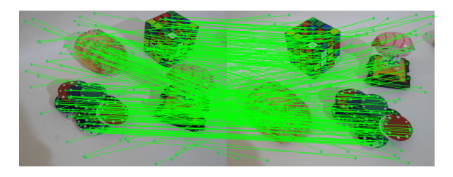
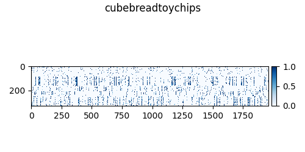
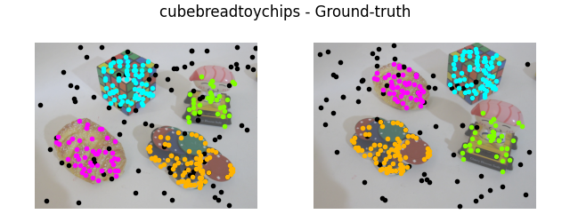
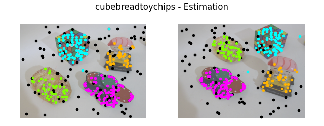

# T-Linkage

> Python implementation of [T-Linkage](https://www.cv-foundation.org/openaccess/content_cvpr_2014/papers/Magri_T-Linkage_A_Continuous_2014_CVPR_paper.pdf)

> Test dataset: [AdelaideRMF](https://osf.io/gb5yc/)

#### Required libraries: 
- opencv
- numpy
- scipy
- matplotlin

#### Instructions
- Run a_main.py

### Inputs
- mode: select between motion and plaene segmentation
  
  Set
  - 1 for motion segmentation (fundamental matrix estimation)
  - 2 for plane segmentation (homography estimation)

- k: it is the value of the image-pair you want to test
  
  Set a value from 0 to 18

### Output example
- Matches

- Preference Matrix

- Ground truth

- Estimation 

