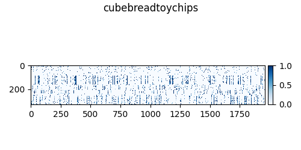
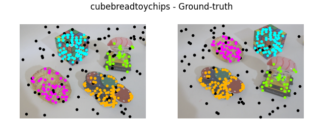
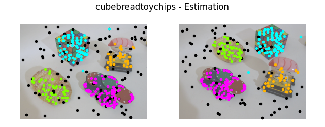

# T-Linkage

> Python implementation of T-Linkage

#### Required libraries: 
- opencv
- numpy
- scipy
- matplotlin

#### Instructions
- Run a_main.py

### Inputs
- mode:
  - 1 for motion segmentation (fundamental matrix estimation)
  - 2 for plane segmentation (homography estimation)

- k:
  - it is the value of the image-pair you want to test
  - you can set a value from 0 to 18

### Output example
- Matches

- Preference Matrix

- Ground truth

- Estimation 

